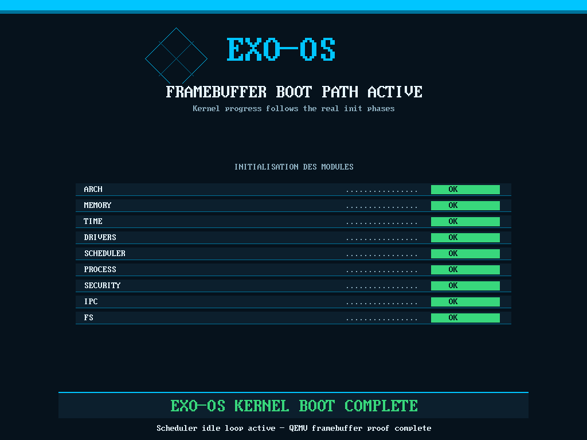

<div align="center">

```
███████╗██╗  ██╗ ██████╗       ██████╗ ███████╗
██╔════╝╚██╗██╔╝██╔═══██╗     ██╔═══██╗██╔════╝
█████╗   ╚███╔╝ ██║   ██║     ██║   ██║███████╗
██╔══╝   ██╔██╗ ██║   ██║     ██║   ██║╚════██║
███████╗██╔╝ ██╗╚██████╔╝     ╚██████╔╝███████║
╚══════╝╚═╝  ╚═╝ ╚═════╝       ╚═════╝ ╚══════╝
```

### Microkernel Hybride Haute Performance

[](.)
[](.)
[](.)
[](.)
[](.)
[](.)

<br>

*"security, performance and freedom"*

<br>
# ExoOS

**A formally verified, capability-based microkernel for x86_64 bare-metal hardware.**

ExoOS is a from-scratch Rust microkernel featuring a dual-kernel fault-tolerant architecture (ExoPhoenix), hardware-enforced security (ExoShield), and a complete formal verification corpus of 12 TLA+ modules covering 60 safety and liveness properties.

> **Status:** Architecture v7 finalized · Formal verification complete (12/12 modules) · First boot validated on QEMU · ExoPhoenix release resurrection validated · Implementation of remaining P0 security patches in progress.

## Boot Milestone

ExoOS now reaches the end of `kernel_main()` under QEMU and emits `OK` on the debug path after completing the visible boot stages:

- `ARCH`
- `MEMORY`
- `TIME`
- `DRIVERS`
- `SCHEDULER`
- `PROCESS`
- `SECURITY`
- `IPC`
- `FS`

Latest validated framebuffer capture:



Boot validation artifacts are stored in [`docs/avancement/qemu_boot/`](docs/avancement/qemu_boot/).

---

## ExoPhoenix Release Resurrection Milestone

On 2026-05-05, ExoPhoenix was validated in QEMU on the optimized release path, not only on the debug proof ISO. The test injects a controlled Ring 0 divide-error (`#DE`) after a successful boot, lets Kernel B observe Kernel A collapse, locks the IOMMU handoff window, verifies the clean Kernel A image contract, reloads the clean ExoFS-backed image, and resumes on a healthy landing path.

The release-only IDT failure found during the first proof pass was fixed by correcting the inline assembly contracts for `lgdt` and `lidt`: both instructions read their pseudo-descriptor from memory, so they must not be declared `nomem`. The relevant fix is in [`kernel/src/arch/x86_64/gdt.rs`](kernel/src/arch/x86_64/gdt.rs) and [`kernel/src/arch/x86_64/idt.rs`](kernel/src/arch/x86_64/idt.rs).

Release proof excerpt:

```text
OK
[ExoPhoenix] Test de résurrection: autodestruction Ring 0 armée
[ExoPhoenix] Kernel A effondré: Division par zéro kernel
[ExoPhoenix] Core 0: heartbeat Kernel A arrêté
[ExoPhoenix] Handoff déclenché, IOMMU verrouillé
[ExoPhoenix] Forge: contract OK
[ExoPhoenix] ExoFS propre vérifié, image Kernel A rechargée
[ExoPhoenix] Kernel A relancé depuis image saine
[ExoPhoenix] RESURRECTION_OK
```

Validation results:

| Check | Result |
|---|---|
| `make iso-release-phoenix-resurrection` | OK, produced `exo-os-phoenix-release.iso` |
| QEMU release resurrection | OK, `QEMU_STATUS:33` via `isa-debug-exit` |
| QEMU interrupt trace | Real `#DE` at CPL0, valid `IDT=... 00000fff`, no triple fault |
| QEMU release normal boot | Reaches `OK`; timeout `124` is expected idle behavior |
| `make build` | OK |
| `make test` | `2975 passed; 0 failed; 3 ignored` |
| `./run_tests.sh --verbose` | `PASS 25`, `FAIL 0`, `WARN 0` |
| TLA+ SANY | OK for `ExoPhoenixHandoff` and `ExoOS_Full` |
| TLA+ TLC simulation | `11046 states checked`, finished in 6s |
| ExoPhoenix degraded hash warning | Not present in captured build/test/proof logs |

Proof artifacts have been moved into [`docs/avancement/exophoenix_release_resurrection_2026-05-05/`](docs/avancement/exophoenix_release_resurrection_2026-05-05/), including the release E9 proof log, QEMU status, IDT excerpt, normal release boot log, unit/integration test logs, and TLA+ logs.

Diagnostic note for external presentations: the proof log still contains `[CAL:PIT-DRV-FAIL][CAL:FB3G][TIME-INIT hz=3000000000]`. This is expected on the current QEMU TCG path: the PIT driver calibration may fail, then ExoOS intentionally falls back to the 3 GHz constant-TSC calibration path. This timing fallback is documented in [`docs/kernel/BOOT_FIX_HISTORY.md`](docs/kernel/BOOT_FIX_HISTORY.md) and is not an ExoPhoenix failure. The short pre-`OK` byte sequence (`XK...`, `4D56...`) is early bring-up/debug-port telemetry emitted before the formatted boot logger is fully initialized.

---

## Architecture Overview

ExoOS is built around three core design principles:

**Capability-based security** — Every kernel resource (memory, IRQ, DMA, PCI device) is accessed exclusively through unforgeable capability tokens. No ambient authority exists anywhere in the system.

**Dual-kernel fault tolerance (ExoPhoenix)** — A dedicated sentinel kernel (Kernel B) runs on Core 0 and continuously monitors the primary kernel (Kernel A). On anomaly detection, Kernel B freezes all Kernel A cores via IPI, snapshots RAM state, and restores a clean execution environment without requiring a full reboot.

**Hardware-enforced containment (ExoShield)** and process containment module combining Intel CET shadow stacks (ExoCage), temporal capability budgets (ExoKairos), static IOMMU NIC policy, and an append-only tamper-evident audit ledger (ExoLedger P0).

---

## Key Technical Specifications

| Component | Specification |
|---|---|
| Language | Rust (`no_std`, x86_64 bare-metal) |
| Architecture | Hybrid microkernel, Ring 0 / Ring 1 |
| Kernel model | Dual-kernel A+B (ExoPhoenix v6) |
| Boot sequence | 18-step ordered boot, SECURITY_READY at step 18 |
| Lock order | Memory → Scheduler → Security → IPC → FS |
| TCB layout | GI-01 canonical, 256 bytes, hardcoded offsets |
| SSR layout | Physical `[0x1000000..0x110000]`, E820 reserved |
| Syscalls | 530–546 (driver framework) |
| POSIX coverage | ~95% via ExoFS Translation Layer v5 |
| Formal verification | 12 TLA+ modules, 60 properties, ~1.2B states checked |

---

## Formal Verification Results

All 12 architectural modules have been formally verified using TLA+ TLC Model Checker. Each module was exhaustively verified (BFS, zero violations). The full system composition was validated via Monte Carlo simulation (565M+ states, 5.1M+ traces, zero invariant violations).

| Module | States Checked | Result |
|---|---|---|
| 1 · ExoPhoenix Dual-Kernel Handoff | 178,992 | ✅ Verified |
| 2 · SMP Boot Sequence (18-step) | 481 | ✅ Verified |
| 3 · IRQ Routing & Atomic Invariants | 524,288 | ✅ Verified |
| 3 · IRQ Stress (4-core storm) | ~37,137 | ✅ Verified |
| 4 · IOMMU Fault Queue (CAS-based) | 34,790 | ✅ Verified |
| 5 · PCI Claim & do_exit() 7-step | 37,133 | ✅ Verified |
| 6 · Context Switch Atomicity | 135,117 | ✅ Verified |
| 7 · ExoFS Crash Consistency | 5,128 | ✅ Verified |
| 8+9 · ExoShield + CapTokens | 107,584 | ✅ Verified |
| 10 · Process Death & fd_table restore | 342 | ✅ Verified |
| 11 · Memory Ordering (Release/Acquire) | 184 | ✅ Verified |
| 12 · Adversarial (combined attack surface) | 1,495 | ✅ Verified |
| **Full Composition (Monte Carlo)** | **565,076,967** | **✅ Verified** |
| **Full Stress — 6 cores (Monte Carlo)** | **634,564,537** | **✅ Verified** |

**Properties proven include:** dual-kernel exclusivity, FPU coherence across context switches, SECURITY_READY ordering, IRQ EOI guarantees, DMA use-after-free prevention, capability unforgeability, constant-time token verification, IOMMU NIC exfiltration impossibility, and full adversarial resilience (6 simultaneous attack vectors).

Full TLA+ specifications and verification outputs are in [`docs/Exo-OS-TLA+/`](docs/Exo-OS-TLA+/).

---

## Repository Structure

| Path | Description |
|------|-------------|
| `Exo-OS/` | Root of the OS project |
| `Exo-OS/kernel/` | Ring 0 – microkernel core (Rust no_std) |
| `Exo-OS/kernel/src/boot/` | 18-step boot sequence, SMP init |
| `Exo-OS/kernel/src/memory/` | Buddy allocator, PhysAddr/VirtAddr/IoVirtAddr |
| `Exo-OS/kernel/src/scheduler/` | TCB GI-01, context switch (switch.rs) |
| `Exo-OS/kernel/src/security/` | ExoShield: ExoSeal, ExoCage, ExoKairos |
| `Exo-OS/kernel/src/ipc/` | SpscRing, CapTokens, reply_nonce |
| `Exo-OS/kernel/src/drivers/` | Driver framework v10, syscalls 530–546 |
| `Exo-OS/kernel/src/exophoenix/` | ExoPhoenix v6 dual-kernel handoff |
| `Exo-OS/ring1/` | Ring 1 – system servers |
| `Exo-OS/ring1/ipc_broker/` | PID 2, ExoCordon DAG enforcement |
| `Exo-OS/ring1/memory_server/` | Physical memory management |
| `Exo-OS/ring1/vfs_server/` | PID 3, ExoFS Translation Layer v5 |
| `Exo-OS/ring1/crypto_server/` | PID 4, ChaCha20, Blake3 |
| `Exo-OS/ring1/device_server/` | Driver host |
| `Exo-OS/ring1/exo_shield/` | Phase 3 AI containment module |
| `Exo-OS/docs/` | Documentation root |
| `Exo-OS/docs/Exo-OS-TLA+/` | 12 TLA+ modules + verification outputs (FR) |
| `Exo-OS/docs/recast/` | Architecture v7 specs + CORR-01..54 audit corpus (FR) |
| `Exo-OS/docs/old/` | First code used before recast (FR) |
| `Exo-OS/Cargo.toml` | Workspace manifest |


---

## ExoShield — AI Containment Module
ExoShield v1.0 is designed for enhanced security within ExoOS. It relies on three main validated modules:

- **ExoSeal** — Reverse boot order: Kernel B boots first and locks the IOMMU policy before Kernel A, preventing any policy changes after boot.

- **ExoCage** — Control flow integrity ensured by Intel CET hardware. Shadow stack tokens prevent SROP attacks. Any `#CP` exception triggers an immediate transfer to ExoPhoenix.

- **ExoKairos** — Integrated capacity budgets with masked expiration dates, stored only in ring 0. `calls_left` is an `AtomicU32` that is decremented with each use. The expiration MAC address (HMAC-Blake3) is inaccessible to ring 1 code.

The static whitelist of IOMMU network adapters is locked by Kernel B at boot. Physical exfiltration from the network is impossible after locking (TLA+ property S40).

Six security properties are formally specified and verified in TLA+: `S33` through `S40`.

---
## Ring 1 Startup Order (V4 Canonical)

```
| PID | Server / Component     | Description                               |
|-----|------------------------|-------------------------------------------|
| 2   | ipc_broker             | ExoCordon DAG enforcement                 |
| —   | memory_server          | Physical memory                           |
| 1   | init_server            | Process lifecycle, ChildDied handler      |
| 3   | vfs_server             | ExoFS TL v5, ~95% POSIX                   |
| 4   | crypto_server          | ChaCha20, Blake3, nonce management        |
| —   | device_server          | Driver host                               |
| —   | virtio-block           | Storage                                   |
| —   | virtio-net             | Network                                   |
| —   | virtio-console         | Console                                   |
| —   | network_server         | TCP/IP stack                              |
| —   | scheduler_server       | Userspace scheduling                      |
| —   | exo_shield             | Phase 3 only — AI containment             |

| Governing Rules | `SRV-01/02/04`, `CAP-01`, `IPC-01/02/03`, `PHX-01/02/03` |


---

## Current Status & Roadmap

**Completed**
- Architecture v7 (5 design cycles, 45 CI checks)
- 18-step boot sequence specification
- Driver Framework v10 (syscalls 530–546, 55 DRV-* silent errors catalogued)
- ExoFS Translation Layer v5 (36 TL-rules, Wine target via POSIX TL + Linux Shim Phase 9)
- ExoShield v1.0 specification (multi-AI consensus process)
- Full TLA+ formal verification corpus (CORR-01..54 + SRV-05)
- First boot validated on QEMU
- ExoPhoenix release resurrection proof on QEMU (`#DE` collapse, handoff, IOMMU lock, clean image reload, relaunch)

**In Progress (P0 blockers)**
- `SSR_MAX_CORES_LAYOUT` constant divergence fix (shared crate vs kernel local)
- `security_init()` boot wiring
- `init_syscall()` on AP cores (currently BSP only)
- `gs:[0x20]` write during context switch (P0-D)

**Roadmap**
- Phase 0 — Codebase coherence (P0 patches above)
- Phase 1 — Critical security (LAC-01/04/06, CVE-EXO-001)
- Phase 2 — Robustness hardening
- Phase 3 — Full Ring 1 servers + ExoShield activation
- Phase 4 — ExoPhoenix live testing + quality

---

## Formal Verification Reproduction

```bash
# Requirements: Java JDK 11+, tla2tools.jar
# https://github.com/tlaplus/tlaplus/releases

cd docs/Exo-OS-TLA+/

# Run individual module (example: SMP Boot)
java -Xmx4g -XX:+UseParallelGC -jar tla2tools.jar \
     -workers auto -config SmpBoot.cfg SmpBoot.tla

# Run full composition (Monte Carlo simulation)
java -Xmx4g -XX:+UseParallelGC \
     -cp /path/to/tla2tools.jar tlc2.TLC \
     -simulate -deadlock -depth 50 -workers auto \
     -config ExoOS_Composition.cfg ExoOS_Full.tla

# Run stress mode (6 cores, adversarial)
java -Xmx10g -XX:+UseParallelGC \
     -cp /path/to/tla2tools.jar tlc2.TLC \
     -simulate -deadlock -depth 50 -workers auto \
     -config ExoOS_Stress.cfg ExoOS_Full.tla
```

---

## Design Decisions & References

- **Why Rust?** Memory safety by construction at Ring 0. `no_std` enforces zero implicit allocations in interrupt paths.
- **Why dual-kernel?** Single-kernel fault tolerance requires the kernel to trust itself. Kernel B runs on a physically isolated core with no shared mutable state with Kernel A.
- **Why TLA+?** Race conditions, memory ordering bugs, and capability lifecycle errors are invisible to unit tests. TLA+ explores all interleavings exhaustively.
- **Influenced by:** seL4 (capability model), Redox (Rust kernel approach), QubesOS (isolation philosophy), ExoKernel (resource abstraction).

---

## Contributing

This project is in early development. Architecture specifications and TLA+ models are in `docs/`. Issues and discussions welcome.


---

*ExoOS — Architecture v7 · April 2026*  
*12 TLA+ modules · 60 properties · ~1.2B states verified*
