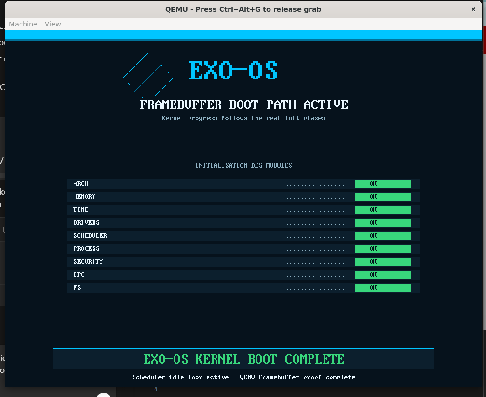

<div align="center">

```
               ███████╗██╗  ██╗ ██████╗       ██████╗ ███████╗
               ██╔════╝╚██╗██╔╝██╔═══██╗     ██╔═══██╗██╔════╝
               █████╗   ╚███╔╝ ██║   ██║     ██║   ██║███████╗
               ██╔══╝   ██╔██╗ ██║   ██║     ██║   ██║╚════██║
               ███████╗██╔╝ ██╗╚██████╔╝     ╚██████╔╝███████║
               ╚══════╝╚═╝  ╚═╝ ╚═════╝       ╚═════╝ ╚══════╝
```

### Microkernel Hybride Haute Performance

[](.)
[](.)
[](.)
[](.)
[](.)
[](.)

<br>

*"security, performance and freedom"*

<br>
# ExoOS

**A formally verified, capability-based microkernel for x86_64 bare-metal hardware.**

ExoOS is a from-scratch Rust microkernel featuring a dual-kernel fault-tolerant architecture (ExoPhoenix), hardware-enforced security (ExoShield), and a complete formal verification corpus of 12 TLA+ modules covering 60 safety and liveness properties.

> **Status:** ExoOS v0.1.0 "Elder and Bobby" closed · QEMU boot to interactive userspace shell validated · ExoPhoenix release resurrection validated · Ring1 services and minimal terminal usable.

## ExoOS v0.1.0 "Elder and Bobby"

Version 0.1.0 marks the first complete interactive milestone of ExoOS: the kernel boots, seeds the Ring1 payloads, starts the service graph, launches `exosh`, and exposes a usable terminal through QEMU.

Validated state:

| Area | v0.1.0 result |
|---|---|
| Boot | GRUB Multiboot2 ISO boots under QEMU q35 and reaches the userspace console |
| Ring1 payloads | `init_server`, `ipc_router`, `memory_server`, `vfs_server`, `crypto_server`, `device_server`, `virtio_drivers`, `network_server`, `scheduler_server`, `input_server`, `tty_server`, `exo_shield`, `exosh` |
| Payload size | Boot payloads are copied then stripped into `target/boot-payloads-stripped` before kernel injection |
| Timekeeping | TSC calibration now accepts PIT driver measurements and no longer falls back to fixed `FB3G` when PIT succeeds |
| Terminal | Visible cursor, keyboard input, Ctrl+L, left/right editing, up/down history recall |
| ExoFS shell workflow | Directory and file creation, read/write, copy, move, remove, listing, tree view, simple benchmarks |
| Diagnostics | Kernel debug traces are quiet by default; verbose kernel trace can be re-enabled with `EXO_KERNEL_TRACE=1` |

Latest validated QEMU E9 boot line:

```text
[CAL:PIT-DRV hz=2614777097][TIME-INIT hz=2614800000]
```

The detailed closure reports are in:

- [`docs/kernel/EXOOS_V0_1_0_ELDER_AND_BOBBY_RELEASE.md`](docs/kernel/EXOOS_V0_1_0_ELDER_AND_BOBBY_RELEASE.md)
- [`docs/kernel/USERSPACE_CONSOLE_SHELL_REPORT.md`](docs/kernel/USERSPACE_CONSOLE_SHELL_REPORT.md)
- [`docs/kernel/BOOT_PAYLOADS_QEMU_RUNBOOK.md`](docs/kernel/BOOT_PAYLOADS_QEMU_RUNBOOK.md)
- [`docs/kernel/TIMEKEEPING_TRACE_CLEANUP_REPORT.md`](docs/kernel/TIMEKEEPING_TRACE_CLEANUP_REPORT.md)

## Boot Milestone

ExoOS now reaches the Ring1 userspace console under QEMU. The boot path completes the kernel stages, seeds the embedded `/sbin` payloads, starts `init_server`, boots the service graph, and drops into `exosh:/$` as an interactive session.

- `ARCH`
- `MEMORY`
- `TIME`
- `DRIVERS`
- `SCHEDULER`
- `PROCESS`
- `SECURITY`
- `IPC`
- `FS`

Latest validated framebuffer capture:

(docs/avancement/qemu_boot/img2.png)

Boot validation artifacts are stored in [`docs/avancement/qemu_boot/`](docs/avancement/qemu_boot/) and the v0.1.0 verification log is stored in [`docs/special/1/qemu_verify/e9.log`](docs/special/1/qemu_verify/e9.log).

---

## ExoPhoenix Release Resurrection Milestone

On 2026-05-05, ExoPhoenix was validated in QEMU on the optimized release path, not only on the debug proof ISO. The test injects a controlled Ring 0 divide-error (`#DE`) after a successful boot, lets Kernel B observe Kernel A collapse, locks the IOMMU handoff window, verifies the clean Kernel A image contract, reloads the clean ExoFS-backed image, and resumes on a healthy landing path.

The release-only IDT failure found during the first proof pass was fixed by correcting the inline assembly contracts for `lgdt` and `lidt`: both instructions read their pseudo-descriptor from memory, so they must not be declared `nomem`. The relevant fix is in [`kernel/src/arch/x86_64/gdt.rs`](kernel/src/arch/x86_64/gdt.rs) and [`kernel/src/arch/x86_64/idt.rs`](kernel/src/arch/x86_64/idt.rs).

Release proof excerpt:

```text
OK
[ExoPhoenix] Test de résurrection: autodestruction Ring 0 armée
[ExoPhoenix] Kernel A effondré: Division par zéro kernel
[ExoPhoenix] Core 0: heartbeat Kernel A arrêté
[ExoPhoenix] Handoff déclenché, IOMMU verrouillé
[ExoPhoenix] Forge: contract OK
[ExoPhoenix] ExoFS propre vérifié, image Kernel A rechargée
[ExoPhoenix] Kernel A relancé depuis image saine
[ExoPhoenix] RESURRECTION_OK
```

Validation results:

| Check | Result |
|---|---|
| `make iso-release-phoenix-resurrection` | OK, produced `exo-os-phoenix-release.iso` |
| QEMU release resurrection | OK, `QEMU_STATUS:33` via `isa-debug-exit` |
| QEMU interrupt trace | Real `#DE` at CPL0, valid `IDT=... 00000fff`, no triple fault |
| QEMU release normal boot | Reaches `OK`; timeout `124` is expected idle behavior |
| `make build` | OK |
| `make test` | `2975 passed; 0 failed; 3 ignored` |
| `./run_tests.sh --verbose` | `PASS 25`, `FAIL 0`, `WARN 0` |
| TLA+ SANY | OK for `ExoPhoenixHandoff` and `ExoOS_Full` |
| TLA+ TLC simulation | `11046 states checked`, finished in 6s |
| ExoPhoenix degraded hash warning | Not present in captured build/test/proof logs |

Proof artifacts have been moved into [`docs/avancement/exophoenix_release_resurrection_2026-05-05/`](docs/avancement/exophoenix_release_resurrection_2026-05-05/), including the release E9 proof log, QEMU status, IDT excerpt, normal release boot log, unit/integration test logs, and TLA+ logs.

Diagnostic note for external presentations: older proof logs may contain `[CAL:PIT-DRV-FAIL][CAL:FB3G][TIME-INIT hz=3000000000]`. That was the pre-v0.1.0 timing fallback. The PIT formula has since been corrected, and the current validated QEMU path reports `[CAL:PIT-DRV hz=...][TIME-INIT hz=...]`. The short pre-`OK` byte sequence (`XK...`, `4D56...`) is early bring-up/debug-port telemetry emitted before the formatted boot logger is fully initialized.

---

## Quick Start

The supported development path is Linux or WSL2 with QEMU and the Rust nightly toolchain. From Windows, run all build and QEMU commands through WSL.

Install the usual host tools:

```bash
sudo apt update
sudo apt install -y build-essential qemu-system-x86 xorriso grub-pc-bin grub-common mtools llvm
rustup toolchain install nightly
rustup component add rust-src rustfmt clippy llvm-tools-preview --toolchain nightly
```

Build the current ISO from source:

```bash
cd /mnt/c/Users/xavie/Desktop/Exo-OS
make iso
```

Run the full build-and-boot path:

```bash
make qemu
```

Run an already-built ISO without rebuilding:

```bash
qemu-system-x86_64 \
  -machine q35 \
  -m 256M \
  -boot d \
  -vga std \
  -serial stdio \
  -no-reboot \
  -no-shutdown \
  -d int,cpu_reset -D /tmp/qemu-exoos.log \
  -debugcon file:/tmp/e9k.txt \
  -device isa-debug-exit,iobase=0xf4,iosize=0x04 \
  -drive if=none,file=target/qemu/exofs-root.img,format=raw,id=exofs0,cache=writeback \
  -device virtio-blk-pci,drive=exofs0 \
  -cdrom exo-os.iso
```

Read the QEMU debugcon log:

```bash
cat /tmp/e9k.txt
```

Useful validation commands:

```bash
cargo check -p exo-os-kernel --message-format short
cargo check -p exo-exosh --message-format short
make build-boot-payloads
make qemu-shell-smoke
```

---

## Userspace Shell

The v0.1.0 shell is intentionally small, but usable enough to exercise ExoFS and the Ring1 service graph from inside QEMU.

Functional builtins:

| Command | Status |
|---|---|
| `help` | Lists available shell commands |
| `clear`, `Ctrl+L` | Clears the console |
| `pwd`, `cd` | Current directory and navigation |
| `ls`, `ls -l`, `ls -a`, `ls -la`, `ls -lah` | Directory listing, long metadata, hidden files, human sizes |
| `mkdir`, `rmdir` | Directory creation/removal |
| `touch`, `cat`, `echo`, `echo ... > file` | Basic file creation, read, write/redirection |
| `rm`, `rm -f`, `rm -rf`, `rm *` | File and recursive tree removal, including simple glob expansion |
| `cp`, `mv` | File copy and rename/move, including destination directory handling |
| `tree` | Recursive directory display |
| `top`, `ps`, `kill`, `kill -9` | Minimal process/service inspection and signal dispatch |
| `history` | Command history display |
| `time` | Measures a shell command using `clock_gettime` |
| `dd` | Minimal I/O benchmark with `/dev/zero`, `/dev/null`, `bs=`, `count=` |
| `exit` | Exits the shell process; `init_server` may restart it |

Line editing:

| Key | Behavior |
|---|---|
| Left / Right | Move inside the current command line |
| Up / Down | Recall previous commands from history |
| Backspace | Delete before cursor |
| Ctrl+C / Ctrl+D | Cancel current line |
| Blinking reverse-video cursor | Shows the active edit position |

Example session:

```text
exosh:/$ mkdir /tmp
exosh:/$ touch /tmp/a
exosh:/$ echo hello > /tmp/a
exosh:/$ cat /tmp/a
hello
exosh:/$ cp /tmp/a /tmp/b
exosh:/$ mv /tmp/b /tmp/c
exosh:/$ ls -lah /tmp
exosh:/$ time echo ok
exosh:/$ dd if=/dev/zero of=/tmp/bench bs=1M count=4
```

---

## Architecture Overview

ExoOS is built around three core design principles:

**Capability-based security** — Every kernel resource (memory, IRQ, DMA, PCI device) is accessed exclusively through unforgeable capability tokens. No ambient authority exists anywhere in the system.

**Dual-kernel fault tolerance (ExoPhoenix)** — A dedicated sentinel kernel (Kernel B) runs on Core 0 and continuously monitors the primary kernel (Kernel A). On anomaly detection, Kernel B freezes all Kernel A cores via IPI, snapshots RAM state, and restores a clean execution environment without requiring a full reboot.

**Hardware-enforced containment (ExoShield)** and process containment module combining Intel CET shadow stacks (ExoCage), temporal capability budgets (ExoKairos), static IOMMU NIC policy, and an append-only tamper-evident audit ledger (ExoLedger P0).

---

## Key Technical Specifications

| Component | Specification |
|---|---|
| Language | Rust (`no_std`, x86_64 bare-metal) |
| Architecture | Hybrid microkernel, Ring 0 / Ring 1 |
| Kernel model | Dual-kernel A+B (ExoPhoenix v6) |
| Boot sequence | 18-step ordered boot, SECURITY_READY at step 18 |
| Lock order | Memory → Scheduler → Security → IPC → FS |
| TCB layout | GI-01 canonical, 256 bytes, hardcoded offsets |
| SSR layout | Physical `[0x1000000..0x110000]`, E820 reserved |
| Syscalls | 530–546 (driver framework) |
| POSIX coverage | ~95% via ExoFS Translation Layer v5 |
| Formal verification | 12 TLA+ modules, 60 properties, ~1.2B states checked |

---

## Formal Verification Results

All 12 architectural modules have been formally verified using TLA+ TLC Model Checker. Each module was exhaustively verified (BFS, zero violations). The full system composition was validated via Monte Carlo simulation (565M+ states, 5.1M+ traces, zero invariant violations).

| Module | States Checked | Result |
|---|---|---|
| 1 · ExoPhoenix Dual-Kernel Handoff | 178,992 | ✅ Verified |
| 2 · SMP Boot Sequence (18-step) | 481 | ✅ Verified |
| 3 · IRQ Routing & Atomic Invariants | 524,288 | ✅ Verified |
| 3 · IRQ Stress (4-core storm) | ~37,137 | ✅ Verified |
| 4 · IOMMU Fault Queue (CAS-based) | 34,790 | ✅ Verified |
| 5 · PCI Claim & do_exit() 7-step | 37,133 | ✅ Verified |
| 6 · Context Switch Atomicity | 135,117 | ✅ Verified |
| 7 · ExoFS Crash Consistency | 5,128 | ✅ Verified |
| 8+9 · ExoShield + CapTokens | 107,584 | ✅ Verified |
| 10 · Process Death & fd_table restore | 342 | ✅ Verified |
| 11 · Memory Ordering (Release/Acquire) | 184 | ✅ Verified |
| 12 · Adversarial (combined attack surface) | 1,495 | ✅ Verified |
| **Full Composition (Monte Carlo)** | **565,076,967** | **✅ Verified** |
| **Full Stress — 6 cores (Monte Carlo)** | **634,564,537** | **✅ Verified** |

**Properties proven include:** dual-kernel exclusivity, FPU coherence across context switches, SECURITY_READY ordering, IRQ EOI guarantees, DMA use-after-free prevention, capability unforgeability, constant-time token verification, IOMMU NIC exfiltration impossibility, and full adversarial resilience (6 simultaneous attack vectors).

Full TLA+ specifications and verification outputs are in [`docs/Exo-OS-TLA+/`](docs/Exo-OS-TLA+/).

---

## Repository Structure

| Path | Description |
|------|-------------|
| `Exo-OS/` | Root of the OS project |
| `Exo-OS/kernel/` | Ring 0 – microkernel core (Rust no_std) |
| `Exo-OS/kernel/src/boot/` | 18-step boot sequence, SMP init |
| `Exo-OS/kernel/src/memory/` | Buddy allocator, PhysAddr/VirtAddr/IoVirtAddr |
| `Exo-OS/kernel/src/scheduler/` | TCB GI-01, context switch (switch.rs) |
| `Exo-OS/kernel/src/security/` | ExoShield: ExoSeal, ExoCage, ExoKairos |
| `Exo-OS/kernel/src/ipc/` | SpscRing, CapTokens, reply_nonce |
| `Exo-OS/kernel/src/drivers/` | Driver framework v10, syscalls 530–546 |
| `Exo-OS/kernel/src/exophoenix/` | ExoPhoenix v6 dual-kernel handoff |
| `Exo-OS/servers/` | Ring1 service graph and userspace system servers |
| `Exo-OS/servers/init_server/` | PID 1, service graph bootstrap and shell launch |
| `Exo-OS/servers/ipc_router/` | PID 2, IPC routing service |
| `Exo-OS/servers/memory_server/` | PID 3, memory service |
| `Exo-OS/servers/vfs_server/` | PID 4, VFS bridge over ExoFS |
| `Exo-OS/servers/crypto_server/` | PID 5, crypto service |
| `Exo-OS/servers/device_server/` | PID 6, device service |
| `Exo-OS/servers/virtio_drivers/` | PID 7, VirtIO driver host |
| `Exo-OS/servers/exosh/` | Interactive userspace shell |
| `Exo-OS/docs/` | Documentation root |
| `Exo-OS/docs/Exo-OS-TLA+/` | 12 TLA+ modules + verification outputs (FR) |
| `Exo-OS/docs/recast/` | Architecture v7 specs + CORR-01..54 audit corpus (FR) |
| `Exo-OS/docs/old/` | First code used before recast (FR) |
| `Exo-OS/Cargo.toml` | Workspace manifest |


---

## ExoShield — AI Containment Module
ExoShield v1.0 is designed for enhanced security within ExoOS. It relies on three main validated modules:

- **ExoSeal** — Reverse boot order: Kernel B boots first and locks the IOMMU policy before Kernel A, preventing any policy changes after boot.

- **ExoCage** — Control flow integrity ensured by Intel CET hardware. Shadow stack tokens prevent SROP attacks. Any `#CP` exception triggers an immediate transfer to ExoPhoenix.

- **ExoKairos** — Integrated capacity budgets with masked expiration dates, stored only in ring 0. `calls_left` is an `AtomicU32` that is decremented with each use. The expiration MAC address (HMAC-Blake3) is inaccessible to ring 1 code.

The static whitelist of IOMMU network adapters is locked by Kernel B at boot. Physical exfiltration from the network is impossible after locking (TLA+ property S40).

Six security properties are formally specified and verified in TLA+: `S33` through `S40`.

---
## Ring 1 Startup Order (V4 Canonical)

| PID | Server / Component | Description |
|---|---|---|
| 1 | `init_server` | PID1, service graph, launches `exosh` and `exo_shield` |
| 2 | `ipc_router` | IPC routing and control endpoint registration |
| 3 | `memory_server` | Ring1 memory service |
| 4 | `vfs_server` | VFS bridge backed by ExoFS |
| 5 | `crypto_server` | Crypto service |
| 6 | `device_server` | Device service |
| 7 | `virtio_drivers` | VirtIO driver host |
| 8 | `network_server` | Network service placeholder |
| 9 | `scheduler_server` | Userspace scheduler service |
| 10 | `input_server` | Input service |
| 11 | `tty_server` | TTY service |
| 12 | `exo_shield` | Containment service |
| 13 | `exosh` | Interactive userspace shell |

Governing rules: `SRV-01/02/04`, `CAP-01`, `IPC-01/02/03`, `PHX-01/02/03`.


---

## Current Status & Roadmap

**Completed**
- Architecture v7 (5 design cycles, 45 CI checks)
- 18-step boot sequence specification
- Driver Framework v10 (syscalls 530–546, 55 DRV-* silent errors catalogued)
- ExoFS Translation Layer v5 (36 TL-rules, Wine target via POSIX TL + Linux Shim Phase 9)
- ExoShield v1.0 specification (multi-AI consensus process)
- Full TLA+ formal verification corpus (CORR-01..54 + SRV-05)
- First boot validated on QEMU
- ExoPhoenix release resurrection proof on QEMU (`#DE` collapse, handoff, IOMMU lock, clean image reload, relaunch)
- ExoOS v0.1.0 userspace milestone: Ring1 service graph, interactive shell, ExoFS command workflow
- Stripped embedded Ring1 payloads and direct no-rebuild QEMU run path
- PIT TSC calibration fixed on the validated QEMU path

**Next Hardening Targets**
- Replace remaining fixed PID/name shell knowledge with a true process-list syscall.
- Expand `dd`, `cp`, `mv`, and glob handling toward fuller POSIX behavior.
- Keep reducing early debug-byte telemetry into structured boot logs.
- Add broader non-interactive QEMU smoke tests that avoid host keyboard timing flakiness.

**Roadmap**
- Phase 0 — v0.1.0 closure: boot, userspace console, shell workflow
- Phase 1 — Shell/service hardening and process introspection syscall
- Phase 2 — ExoFS benchmark and persistence hardening
- Phase 3 — Full Ring1 server capability routing
- Phase 4 — ExoPhoenix live testing + quality

---

## Formal Verification Reproduction

```bash
# Requirements: Java JDK 11+, tla2tools.jar
# https://github.com/tlaplus/tlaplus/releases

cd docs/Exo-OS-TLA+/

# Run individual module (example: SMP Boot)
java -Xmx4g -XX:+UseParallelGC -jar tla2tools.jar \
     -workers auto -config SmpBoot.cfg SmpBoot.tla

# Run full composition (Monte Carlo simulation)
java -Xmx4g -XX:+UseParallelGC \
     -cp /path/to/tla2tools.jar tlc2.TLC \
     -simulate -deadlock -depth 50 -workers auto \
     -config ExoOS_Composition.cfg ExoOS_Full.tla

# Run stress mode (6 cores, adversarial)
java -Xmx10g -XX:+UseParallelGC \
     -cp /path/to/tla2tools.jar tlc2.TLC \
     -simulate -deadlock -depth 50 -workers auto \
     -config ExoOS_Stress.cfg ExoOS_Full.tla
```

---

## Design Decisions & References

- **Why Rust?** Memory safety by construction at Ring 0. `no_std` enforces zero implicit allocations in interrupt paths.
- **Why dual-kernel?** Single-kernel fault tolerance requires the kernel to trust itself. Kernel B runs on a physically isolated core with no shared mutable state with Kernel A.
- **Why TLA+?** Race conditions, memory ordering bugs, and capability lifecycle errors are invisible to unit tests. TLA+ explores all interleavings exhaustively.
- **Influenced by:** seL4 (capability model), Redox (Rust kernel approach), QubesOS (isolation philosophy), ExoKernel (resource abstraction).

---

## Contributing

This project is in active development after the v0.1.0 userspace milestone. Architecture specifications, proof material, boot reports, and kernel notes are in `docs/`. Issues and discussions welcome.


---

*ExoOS — v0.1.0 "Elder and Bobby" · May 2026*

*12 TLA+ modules · 60 properties · ~1.2B states verified*
