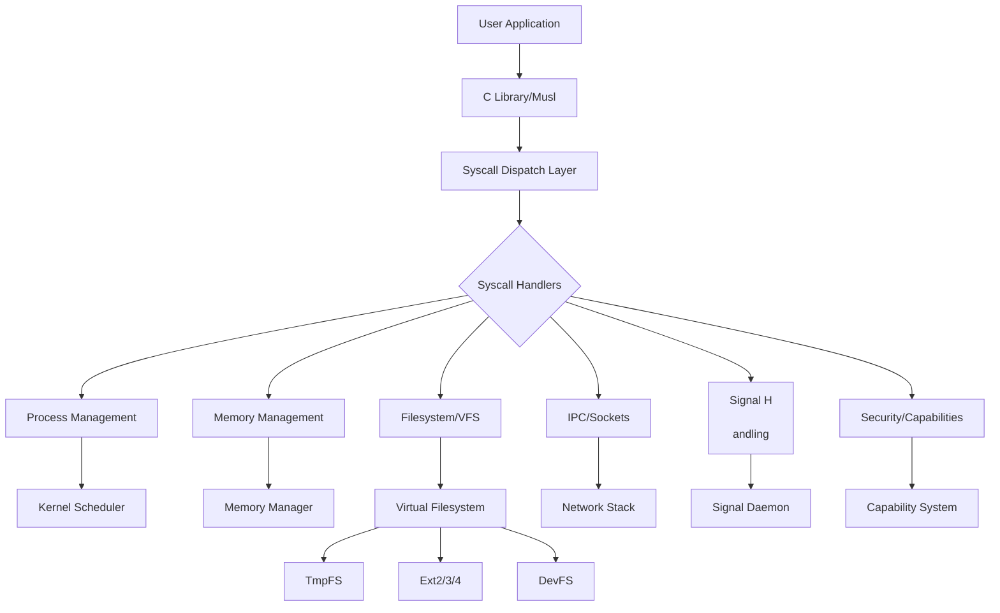
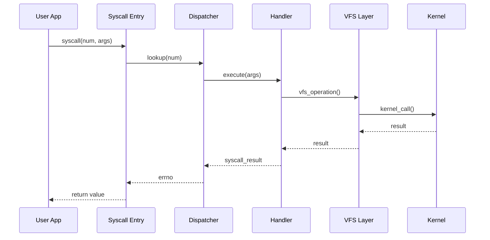
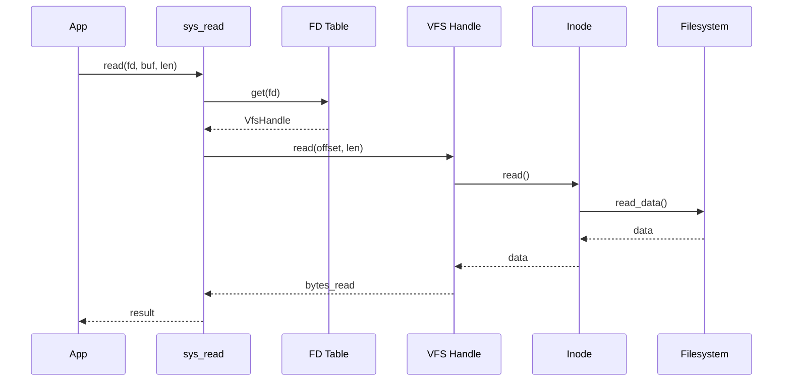
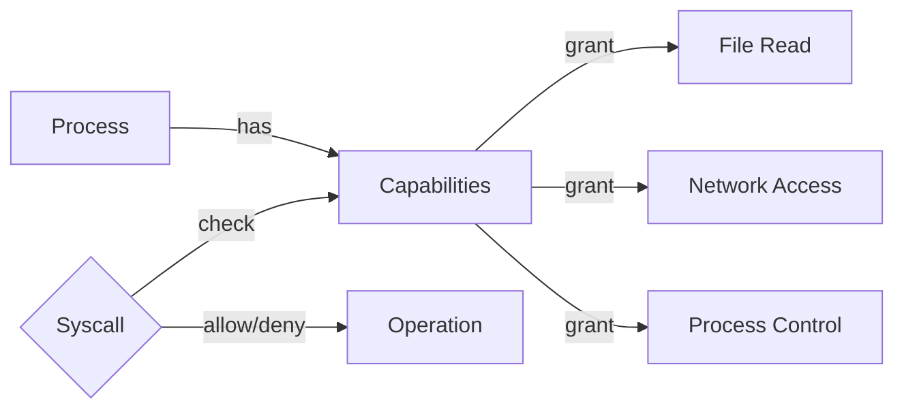

# POSIX-X Architecture

## Table of Contents

1. [Overview](#overview)
2. [System Architecture](#system-architecture)
3. [Core Components](#core-components)
4. [Data Flow](#data-flow)
5. [Module Responsibilities](#module-responsibilities)

---

## Overview

POSIX-X is a comprehensive POSIX compatibility layer for Exo-OS that bridges user-space applications with the kernel. It implements **127 syscalls** across 27 functional areas, achieving approximately **91% POSIX compliance**.

### Design Goals

- **Compatibility**: Support standard POSIX applications
- **Performance**: Minimize overhead in syscall dispatch
- **Modularity**: Clean separation of concerns
- **Security**: Capability-based access control
- **Extensibility**: Easy addition of new syscalls

---

## System Architecture



---

## Core Components

### 1. Syscall Dispatch (`kernel/src/syscall/dispatch.rs`)

**Purpose**: Routes syscall numbers to appropriate handlers.

**Key Features**:

- Fast syscall table lookup
- Error handling and errno conversion
- MSR-based syscall entry (x86_64)
- Support for 127+ syscalls

**Architecture**:

```rust
// Syscall entry point
pub fn syscall_handler(
    syscall_num: u64,
    args: [u64; 6]
) -> u64 {
    // 1. Lookup handler in table
    // 2. Execute handler with args
    // 3. Convert result to errno
    // 4. Return to userspace
}
```

### 2. Handler Modules (`kernel/src/syscall/handlers/`)

Organized by functionality:

| Module | Purpose | Syscalls |
|--------|---------|----------|
| `process.rs` | Process management | fork, exec, wait, exit |
| `memory.rs` | Memory operations | mmap, brk, mprotect |
| `fs_*.rs` | Filesystem operations | open, read, write, stat |
| `net_socket.rs` | Networking | socket, bind, connect |
| `signals.rs` | Signal handling | sigaction, kill |
| `security.rs` | Security/capabilities | prctl, setuid |
| `ipc_sysv.rs` | System V IPC | shmget, semop, msgget |
| `inotify.rs` | File notifications | inotify_init, add_watch |

### 3. VFS Integration (`kernel/src/posix_x/vfs_posix/`)

**Purpose**: Translate POSIX file operations to VFS calls.

**Components**:

- **Path Resolver**: Converts paths to inodes
- **File Operations**: POSIX file handle abstraction
- **Inode Cache**: Performance optimization
- **File Descriptors**: Per-process FD tables

**Data Structures**:

```rust
pub struct VfsHandle {
    inode: Arc<RwLock<dyn Inode>>,
    offset: AtomicU64,
    flags: OpenFlags,
}

pub struct FileDescriptorTable {
    fds: BTreeMap<i32, VfsHandle>,
    next_fd: AtomicI32,
}
```

### 4. Process Management (`kernel/src/posix_x/kernel_interface/`)

**Purpose**: Bridge POSIX process model with Exo-OS threads.

**Components**:

- **Process Control Block (PCB)**: Process metadata
- **Credential Management**: UID/GID handling
- **FD Table**: Per-process file descriptors
- **Signal Handling**: Signal delivery infrastructure

### 5. IPC Infrastructure (`kernel/src/posix_x/kernel_interface/ipc_bridge.rs`)

**Purpose**: Inter-process communication primitives.

**Mechanisms**:

- **Pipes**: Anonymous and named (FIFOs)
- **Unix Sockets**: AF_UNIX domain sockets
- **System V IPC**: Shared memory, semaphores, message queues
- **Event FDs**: eventfd, signalfd

### 6. Signal Daemon (`kernel/src/posix_x/kernel_interface/signal_daemon.rs`)

**Purpose**: Asynchronous signal delivery.

**Features**:

- Signal queuing per process
- Signal mask management
- Handler invocation
- RT signal support

---

## Data Flow

### Syscall Execution Flow



### File Operation Flow



---

## Module Responsibilities

### Kernel Interface Layer

**Location**: `kernel/src/posix_x/kernel_interface/`

**Responsibilities**:

- Abstract kernel-specific details
- Provide POSIX-compatible interfaces
- Manage process-specific state
- Handle resource allocation

**Key Files**:

- `fd_table.rs` - File descriptor management
- `signal_daemon.rs` - Signal delivery
- `ipc_bridge.rs` - IPC primitives
- `capability_cache.rs` - Capability caching

### VFS POSIX Layer

**Location**: `kernel/src/posix_x/vfs_posix/`

**Responsibilities**:

- Path resolution (absolute, relative, symlinks)
- POSIX permission checks
- Inode caching for performance
- File operation translation

**Key Files**:

- `path_resolver.rs` - Path→Inode resolution
- `file_ops.rs` - File operations
- `inode_cache.rs` - Performance cache
- `mod.rs` - VFS initialization

### Syscall Handlers

**Location**: `kernel/src/syscall/handlers/`

**Responsibilities**:

- Implement POSIX syscall semantics
- Parameter validation
- Error code translation
- Call appropriate subsystems

**Key Files**:

- `process.rs` - fork, exec, wait, exit
- `memory.rs` - mmap, brk, mprotect
- `fs_*.rs` - File and directory operations
- `net_socket.rs` - Socket operations
- `signals.rs` - Signal handling
- `security.rs` - Security operations

### Signal Subsystem

**Location**: `kernel/src/posix_x/signals/`

**Responsibilities**:

- Signal generation and delivery
- Signal masks and handlers
- Real-time signal queuing
- Signal-related syscalls

**Key Files**:

- `types.rs` - Signal types and structures
- (Handlers in `syscall/handlers/signals.rs`)

---

## Memory Organization

### Per-Process State

Each process maintains:

```rust
struct ProcessState {
    // Identity
    pid: u64,
    ppid: u64,
    
    // Credentials
    uid: u64,
    gid: u64,
    euid: u64,
    egid: u64,
    
    // File Descriptors
    fd_table: Arc<RwLock<FdTable>>,
    
    // Signals
    signal_mask: SigSet,
    signal_handlers: HashMap<Signal, SigAction>,
    
    // Capabilities
    capabilities: Vec<Capability>,
    
    // Working Directory
    cwd: Arc<RwLock<dyn Inode>>,
}
```

### Global State

- **FD Table**: `GLOBAL_FD_TABLE` (for now, moving to per-process)
- **Signal Daemon**: Background thread for signal delivery
- **Capability Registry**: Process capability mappings
- **IPC Resources**: Shared memory, semaphores, message queues

---

## Performance Considerations

### Fast Paths

1. **Syscall Dispatch**: Direct table lookup, no hash
2. **FD Operations**: Lock-free atomic operations where possible
3. **Path Cache**: Cache frequently accessed paths
4. **Inode Cache**: Reduce VFS lookups

### Optimization Strategies

- **Zero-Copy**: sendfile, splice use zero-copy when possible
- **Lazy Allocation**: Defer resource allocation
- **RCU for Read-Heavy**: Use RwLock for read-heavy structures
- **Batching**: Batch signal delivery

---

## Security Model

### Capability-Based Access Control



**Capabilities**:

- File operations (read, write, execute)
- Process operations (fork, kill, trace)
- Memory operations (map, unmap, protect)
- IPC operations (send, recv, create)
- Network operations (bind, connect, listen)
- System operations (shutdown, reboot, time)

### Permission Checks

```rust
// Example permission check
fn check_file_access(
    inode: &dyn Inode,
    mode: AccessMode
) -> Result<()> {
    // 1. Check capabilities
    if !has_capability(FileRead, inode.id()) {
        return Err(PermissionDenied);
    }
    
    // 2. Check POSIX permissions
    if !check_posix_perms(inode, mode) {
        return Err(PermissionDenied);
    }
    
    Ok(())
}
```

---

## Error Handling

### Error Code Translation

POSIX-X translates kernel errors to POSIX errno values:

```rust
pub enum SyscallError {
    NotFound,           // ENOENT (2)
    PermissionDenied,   // EACCES (13)
    InvalidArgument,    // EINVAL (22)
    // ...
}

impl SyscallError {
    pub fn to_errno(&self) -> i64 {
        match self {
            NotFound => -2,
            PermissionDenied => -13,
            InvalidArgument => -22,
            // ...
        }
    }
}
```

### Error Propagation

Errors flow upward through the stack:

1. Kernel error → MemoryError/VfsError
2. MemoryError/VfsError → SyscallError
3. SyscallError → errno (negative i64)
4. User receives negative errno

---

## Extension Points

### Adding New Syscalls

1. **Define syscall number** in `dispatch.rs`
2. **Implement handler** in appropriate handler module
3. **Register** in `handlers/mod.rs`
4. **Test** with user-space test program

### Adding New Filesystems

1. **Implement** `Inode` trait
2. **Register** filesystem with VFS
3. **Mount** at desired path
4. POSIX-X automatically supports it

### Adding New IPC Mechanisms

1. **Implement** in `kernel_interface/ipc_bridge.rs`
2. **Add syscalls** for operations
3. **Integrate** with FD table if needed

---

## Summary

POSIX-X provides a complete, modular POSIX compatibility layer with:

- ✅ 127 syscalls implemented
- ✅ ~91% POSIX compliance
- ✅ Comprehensive VFS integration
- ✅ Full IPC support
- ✅ Robust signal handling
- ✅ Capability-based security
- ✅ Clean, maintainable architecture

The architecture supports easy extension and modification while maintaining compatibility with standard POSIX applications.
