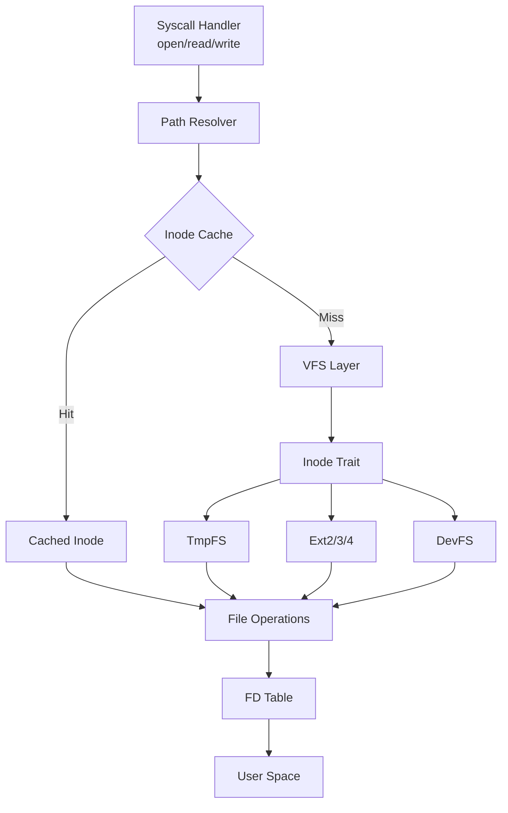
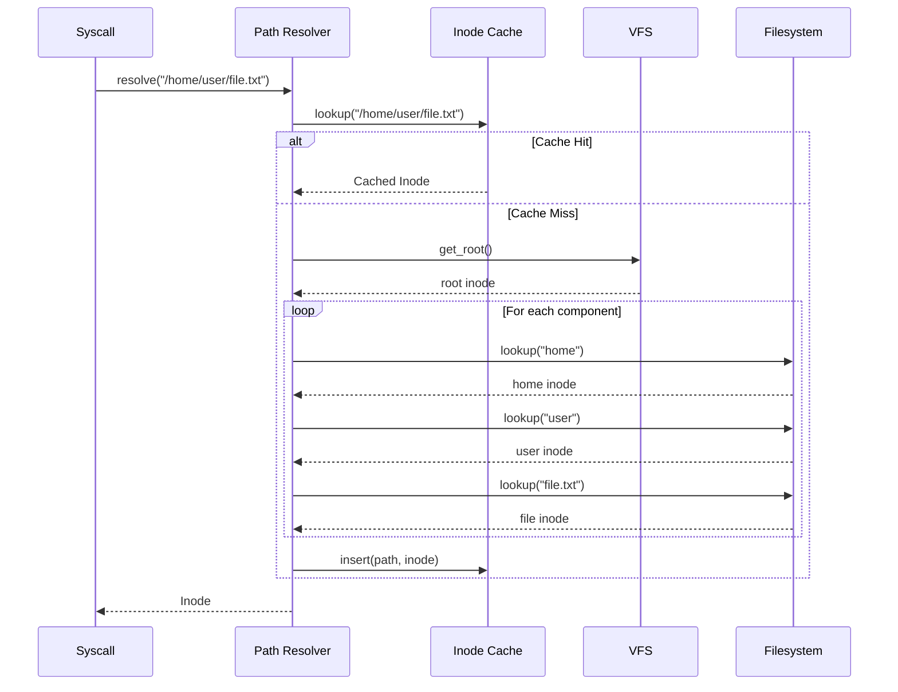

# Virtual Filesystem (VFS) Guide

## Table of Contents

1. [Overview](#overview)
2. [VFS Architecture](#vfs-architecture)
3. [Path Resolution](#path-resolution)
4. [File Operations](#file-operations)
5. [Inode Management](#inode-management)
6. [File Descriptors](#file-descriptors)
7. [Examples](#examples)

---

## Overview

The POSIX-X VFS layer provides a unified interface for file operations across different filesystems. It translates POSIX file operations (open, read, write, etc.) into VFS operations that work with any filesystem implementing the `Inode` trait.

**Location**: `kernel/src/posix_x/vfs_posix/`

**Key Features**:

- **Path Resolution**: Handles absolute, relative, and symbolic links
- **Permission Checking**: POSIX permission model
- **Inode Caching**: Performance optimization
- **Multiple Filesystems**: TmpFS, Ext2/3/4, DevFS support

---

## VFS Architecture

### Component Structure



### Core Types

```rust
// Virtual filesystem handle
pub struct VfsHandle {
    pub inode: Arc<RwLock<dyn Inode>>,
    pub offset: AtomicU64,
    pub flags: OpenFlags,
}

// Path resolver
pub struct PathResolver {
    root: Arc<RwLock<dyn Inode>>,
    symlink_limit: usize,
}

// Inode cache entry
pub struct CacheEntry {
    pub inode: Arc<RwLock<dyn Inode>>,
    pub path: String,
    pub last_access: Instant,
}
```

---

## Path Resolution

### Resolution Process

Path resolution converts a string path into an `Inode` reference:



### Implementation

**File**: `kernel/src/posix_x/vfs_posix/path_resolver.rs`

```rust
pub unsafe fn resolve_path(
    path: *const i8,
    follow_symlinks: bool
) -> Result<Arc<RwLock<dyn Inode>>> {
    // 1. Convert C string to Rust string
    let path_str = ptr_to_str(path)?;
    
    // 2. Check cache
    if let Some(inode) = INODE_CACHE.get(path_str) {
        return Ok(inode);
    }
    
    // 3. Get starting point (root or cwd)
    let mut current = if path_str.starts_with('/') {
        get_root_inode()?
    } else {
        get_cwd_inode()?
    };
    
    // 4. Resolve each component
    for component in path_str.split('/').filter(|s| !s.is_empty()) {
        current = resolve_component(current, component, follow_symlinks)?;
    }
    
    // 5. Cache result
    INODE_CACHE.insert(path_str.to_string(), current.clone());
    
    Ok(current)
}
```

### Special Cases

#### Symbolic Links

```rust
fn resolve_symlink(
    inode: Arc<RwLock<dyn Inode>>,
    symlink_count: &mut usize
) -> Result<Arc<RwLock<dyn Inode>>> {
    // Prevent infinite loops
    if *symlink_count >= MAX_SYMLINKS {
        return Err(VfsError::TooManySymlinks);
    }
    *symlink_count += 1;
    
    // Read symlink target
    let target = inode.read().unwrap().read_link()?;
    
    // Resolve target path
    resolve_path(target.as_ptr() as *const i8, true)
}
```

#### Relative Paths

```rust
fn resolve_relative(path: &str) -> Result<Arc<RwLock<dyn Inode>>> {
    // Get current working directory
    let cwd = get_current_process_cwd()?;
    
    // Handle ".." and "."
    let mut components = Vec::new();
    for component in path.split('/') {
        match component {
            "." | "" => continue,
            ".." => { components.pop(); },
            c => components.push(c),
        }
    }
    
    // Resolve from cwd
    // ...
}
```

#### Mount Points

```rust
fn check_mount_point(
    parent: Arc<RwLock<dyn Inode>>,
    name: &str
) -> Option<Arc<RwLock<dyn Inode>>> {
    // Check if this is a mount point
    let mount_table = MOUNT_TABLE.lock();
    mount_table.get(&(parent.id(), name.to_string()))
        .map(|mp| mp.root.clone())
}
```

---

## File Operations

### Opening Files

**File**: `kernel/src/posix_x/vfs_posix/file_ops.rs`

```rust
pub unsafe fn sys_open_impl(
    path: *const i8,
    flags: i32,
    mode: u32
) -> Result<i32> {
    // 1. Resolve path
    let inode = if flags & O_CREAT != 0 {
        // Create if doesn't exist
        resolve_or_create(path, mode)?
    } else {
        resolve_path(path, true)?
    };
    
    // 2. Check permissions
    check_access(inode.clone(), flags)?;
    
    // 3. Create VFS handle
    let handle = VfsHandle {
        inode,
        offset: AtomicU64::new(0),
        flags: OpenFlags::from_bits(flags).unwrap(),
    };
    
    // 4. Add to FD table
    let fd = GLOBAL_FD_TABLE.insert(handle)?;
    
    Ok(fd)
}
```

### Reading Files

```rust
pub unsafe fn sys_read_impl(
    fd: i32,
    buf: *mut u8,
    count: usize
) -> Result<usize> {
    // 1. Get VFS handle
    let handle = GLOBAL_FD_TABLE.get(fd)?;
    
    // 2. Check flags (O_RDONLY or O_RDWR)
    if !handle.flags.contains(OpenFlags::READABLE) {
        return Err(VfsError::BadFileDescriptor);
    }
    
    // 3. Get current offset
    let offset = handle.offset.load(Ordering::SeqCst);
    
    // 4. Read from inode
    let bytes_read = {
        let inode = handle.inode.read().unwrap();
        inode.read_at(offset, buf, count)?
    };
    
    // 5. Update offset
    handle.offset.fetch_add(bytes_read as u64, Ordering::SeqCst);
    
    Ok(bytes_read)
}
```

### Writing Files

```rust
pub unsafe fn sys_write_impl(
    fd: i32,
    buf: *const u8,
    count: usize
) -> Result<usize> {
    // 1. Get VFS handle
    let handle = GLOBAL_FD_TABLE.get(fd)?;
    
    // 2. Check flags (O_WRONLY or O_RDWR)
    if !handle.flags.contains(OpenFlags::WRITABLE) {
        return Err(VfsError::BadFileDescriptor);
    }
    
    // 3. Handle O_APPEND
    let offset = if handle.flags.contains(OpenFlags::APPEND) {
        let inode = handle.inode.read().unwrap();
        inode.size()
    } else {
        handle.offset.load(Ordering::SeqCst)
    };
    
    // 4. Write to inode
    let bytes_written = {
        let mut inode = handle.inode.write().unwrap();
        inode.write_at(offset, buf, count)?
    };
    
    // 5. Update offset (unless O_APPEND)
    if !handle.flags.contains(OpenFlags::APPEND) {
        handle.offset.fetch_add(bytes_written as u64, Ordering::SeqCst);
    }
    
    Ok(bytes_written)
}
```

### Seeking

```rust
pub unsafe fn sys_lseek_impl(
    fd: i32,
    offset: i64,
    whence: i32
) -> Result<i64> {
    let handle = GLOBAL_FD_TABLE.get(fd)?;
    
    let new_offset = match whence {
        SEEK_SET => offset,
        SEEK_CUR => {
            let current = handle.offset.load(Ordering::SeqCst) as i64;
            current + offset
        },
        SEEK_END => {
            let inode = handle.inode.read().unwrap();
            let size = inode.size() as i64;
            size + offset
        },
        _ => return Err(VfsError::InvalidArgument),
    };
    
    if new_offset < 0 {
        return Err(VfsError::InvalidArgument);
    }
    
    handle.offset.store(new_offset as u64, Ordering::SeqCst);
    Ok(new_offset)
}
```

---

## Inode Management

### Inode Trait

```rust
pub trait Inode: Send + Sync {
    /// Get inode metadata
    fn metadata(&self) -> Result<Metadata>;
    
    /// Read data at offset
    fn read_at(&self, offset: u64, buf: *mut u8, len: usize) -> Result<usize>;
    
    /// Write data at offset
    fn write_at(&mut self, offset: u64, buf: *const u8, len: usize) -> Result<usize>;
    
    /// Lookup child by name (for directories)
    fn lookup(&self, name: &str) -> Result<Arc<RwLock<dyn Inode>>>;
    
    /// Create new file/directory
    fn create(&mut self, name: &str, mode: u32, is_dir: bool) -> Result<Arc<RwLock<dyn Inode>>>;
    
    /// Remove child
    fn unlink(&mut self, name: &str) -> Result<()>;
    
    /// Read directory entries
    fn readdir(&self) -> Result<Vec<DirEntry>>;
    
    /// Get file size
    fn size(&self) -> u64;
    
    /// Truncate file
    fn truncate(&mut self, size: u64) -> Result<()>;
    
    /// Sync to disk
    fn sync(&self) -> Result<()>;
}
```

### Metadata Structure

```rust
pub struct Metadata {
    pub inode_number: u64,
    pub size: u64,
    pub blocks: u64,
    pub atime: u64,
    pub mtime: u64,
    pub ctime: u64,
    pub mode: u32,
    pub nlinks: u32,
    pub uid: u32,
    pub gid: u32,
    pub rdev: u64,
    pub file_type: FileType,
}

pub enum FileType {
    Regular,
    Directory,
    Symlink,
    CharDevice,
    BlockDevice,
    Fifo,
    Socket,
}
```

### Inode Cache

**File**: `kernel/src/posix_x/vfs_posix/inode_cache.rs`

```rust
static INODE_CACHE: Lazy<Mutex<LruCache<String, Arc<RwLock<dyn Inode>>>>> = 
    Lazy::new(|| Mutex::new(LruCache::new(1000)));

pub fn cache_lookup(path: &str) -> Option<Arc<RwLock<dyn Inode>>> {
    let mut cache = INODE_CACHE.lock();
    cache.get(path).cloned()
}

pub fn cache_insert(path: String, inode: Arc<RwLock<dyn Inode>>) {
    let mut cache = INODE_CACHE.lock();
    cache.put(path, inode);
}

pub fn cache_invalidate(path: &str) {
    let mut cache = INODE_CACHE.lock();
    cache.pop(path);
}
```

---

## File Descriptors

### FD Table Structure

**File**: `kernel/src/posix_x/kernel_interface/fd_table.rs`

```rust
pub struct FileDescriptorTable {
    fds: BTreeMap<i32, VfsHandle>,
    next_fd: AtomicI32,
}

impl FileDescriptorTable {
    pub fn insert(&self, handle: VfsHandle) -> Result<i32> {
        let fd = self.next_fd.fetch_add(1, Ordering::SeqCst);
        self.fds.insert(fd, handle);
        Ok(fd)
    }
    
    pub fn get(&self, fd: i32) -> Result<&VfsHandle> {
        self.fds.get(&fd).ok_or(VfsError::BadFileDescriptor)
    }
    
    pub fn remove(&self, fd: i32) -> Result<VfsHandle> {
        self.fds.remove(&fd).ok_or(VfsError::BadFileDescriptor)
    }
    
    pub fn duplicate(&self, oldfd: i32, newfd: Option<i32>) -> Result<i32> {
        let handle = self.get(oldfd)?.clone();
        
        let fd = if let Some(newfd) = newfd {
            // Close newfd if open
            self.remove(newfd).ok();
            self.fds.insert(newfd, handle);
            newfd
        } else {
            self.insert(handle)?
        };
        
        Ok(fd)
    }
}
```

### Standard File Descriptors

```rust
pub fn initialize_std_fds() -> Result<()> {
    let fd_table = GLOBAL_FD_TABLE.lock();
    
    // stdin (0)
    let stdin = open_console(O_RDONLY)?;
    fd_table.insert_at(0, stdin)?;
    
    // stdout (1)
    let stdout = open_console(O_WRONLY)?;
    fd_table.insert_at(1, stdout)?;
    
    // stderr (2)
    let stderr = open_console(O_WRONLY)?;
    fd_table.insert_at(2, stderr)?;
    
    Ok(())
}
```

---

## Examples

### Example 1: Opening and Reading a File

```c
#include <fcntl.h>
#include <unistd.h>
#include <stdio.h>

int main() {
    // Open file
    int fd = open("/etc/passwd", O_RDONLY);
    if (fd < 0) {
        perror("open");
        return 1;
    }
    
    // Read content
    char buffer[1024];
    ssize_t n = read(fd, buffer, sizeof(buffer) - 1);
    if (n < 0) {
        perror("read");
        close(fd);
        return 1;
    }
    
    buffer[n] = '\0';
    printf("%s\n", buffer);
    
    // Close
    close(fd);
    return 0;
}
```

**VFS Flow**:

1. `open()` → `resolve_path("/etc/passwd")` → Get inode
2. Check read permissions
3. Create VfsHandle, add to FD table
4. `read()` → Get handle from FD table
5. Call `inode.read_at(offset, buf, len)`
6. Update offset in handle
7. `close()` → Remove from FD table, drop handle

### Example 2: Creating a Directory

```c
#include <sys/stat.h>
#include <sys/types.h>

int main() {
    // Create directory with rwxr-xr-x permissions
    if (mkdir("/tmp/mydir", 0755) < 0) {
        perror("mkdir");
        return 1;
    }
    
    // Create file in directory
    int fd = open("/tmp/mydir/file.txt", O_CREAT | O_WRONLY, 0644);
    if (fd < 0) {
        perror("open");
        return 1;
    }
    
    write(fd, "Hello\n", 6);
    close(fd);
    return 0;
}
```

**VFS Flow**:

1. `mkdir()` → Resolve `/tmp`
2. Call `tmp_inode.create("mydir", 0755, true)`
3. Return new directory inode
4. `open()` with O_CREAT → Resolve `/tmp/mydir`
5. Call `mydir_inode.create("file.txt", 0644, false)`
6. Create VfsHandle for new file

### Example 3: Symbolic Links

```c
#include <unistd.h>

int main() {
    // Create symlink
    symlink("/etc/passwd", "/tmp/passwd_link");
    
    // Read through symlink (automatically follows)
    char buffer[1024];
    int fd = open("/tmp/passwd_link", O_RDONLY);
    read(fd, buffer, sizeof(buffer));
    close(fd);
    
    // Read symlink target
    char target[256];
    ssize_t len = readlink("/tmp/passwd_link", target, sizeof(target));
    target[len] = '\0';
    printf("Link target: %s\n", target);  // "/etc/passwd"
    
    return 0;
}
```

---

## Performance Considerations

### Caching Strategy

1. **Path Cache**: Cache frequently accessed paths
2. **Inode Cache**: LRU cache of 1000 entries
3. **Negative Cache**: Cache failed lookups to avoid repeated errors

### Optimization Tips

```rust
// Bad: Resolve path every time
for i in 0..1000 {
    let inode = resolve_path("/etc/passwd", true)?;
    // use inode
}

// Good: Resolve once, reuse
let inode = resolve_path("/etc/passwd", true)?;
for i in 0..1000 {
    // use inode
}
```

### Lock Ordering

To avoid deadlocks, always acquire locks in this order:

1. FD Table lock
2. Inode cache lock
3. Individual inode locks

---

## Error Handling

### Common VFS Errors

| Error | Errno | Description |
|-------|-------|-------------|
| `NotFound` | ENOENT (2) | File/directory not found |
| `PermissionDenied` | EACCES (13) | Permission denied |
| `IsDirectory` | EISDIR (21) | Is a directory |
| `NotDirectory` | ENOTDIR (20) | Not a directory |
| `FileExists` | EEXIST (17) | File already exists |
| `TooManySymlinks` | ELOOP (40) | Too many symlinks |
| `BadFileDescriptor` | EBADF (9) | Bad file descriptor |

### Error Propagation

```rust
pub fn handle_vfs_error(err: VfsError) -> i64 {
    match err {
        VfsError::NotFound => -2,        // ENOENT
        VfsError::PermissionDenied => -13, // EACCES
        VfsError::IsDirectory => -21,    // EISDIR
        VfsError::NotDirectory => -20,   // ENOTDIR
        // ...
    }
}
```

---

## Testing

### Unit Tests

```rust
#[test]
fn test_path_resolution() {
    let inode = resolve_path(c_str!("/etc/passwd"), true).unwrap();
    assert_eq!(inode.name(), "passwd");
}

#[test]
fn test_relative_path() {
    set_cwd("/home/user");
    let inode = resolve_path(c_str!("../other/file.txt"), true).unwrap();
    assert_eq!(get_full_path(&inode), "/home/other/file.txt");
}

#[test]
fn test_symlink_loop() {
    // /a -> /b, /b -> /a
    create_symlink("/a", "/b");
    create_symlink("/b", "/a");
    
    let result = resolve_path(c_str!("/a"), true);
    assert!(matches!(result, Err(VfsError::TooManySymlinks)));
}
```

---

## Summary

The POSIX-X VFS layer provides:

- ✅ Complete path resolution (absolute, relative, symlinks)
- ✅ Filesystem-agnostic operations
- ✅ POSIX permission model
- ✅ Performance optimization (caching)
- ✅ Clean abstraction via Inode trait
- ✅ Comprehensive error handling

For related documentation:

- [ARCHITECTURE.md](ARCHITECTURE.md) - Overall system design
- [SYSCALL_REFERENCE.md](SYSCALL_REFERENCE.md) - Syscall catalog
- [API_REFERENCE.md](API_REFERENCE.md) - API documentation
